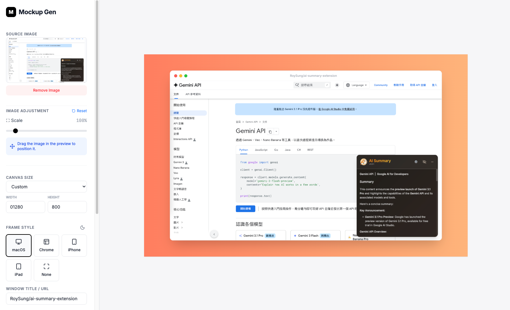

<div align="center">


# Mockup Generator

**Turn any screenshot into a polished product mockup in seconds.**

</div>

## Description

Mockup Generator is a browser-based tool that wraps your screenshots or images inside realistic device frames — Mac window, Chrome browser, smartphone, or tablet — and lets you export them as high-quality PNGs ready for social media, documentation, or marketing materials.

**Key features:**

- **Device frames** — Mac, Chrome, iPhone, and tablet frames with light/dark themes
- **Drag & drop or URL input** — upload a local file or paste an image URL
- **Canvas customization** — adjust padding, background color/gradient, and border radius
- **Image adjustment** — pan and scale the image within the frame
- **Size presets** — Twitter/OG (1200×630), Instagram (square & portrait), Story, Full HD, or custom dimensions
- **One-click export** — download the finished mockup as a 2× retina PNG

## Tech Stack

| Layer       | Technology                      |
| ----------- | ------------------------------- |
| Framework   | React 19                        |
| Language    | TypeScript 5.8                  |
| Build Tool  | Vite 6                          |
| Styling     | Tailwind CSS 4                  |
| Export      | html-to-image                   |
| File Upload | react-dropzone                  |
| Icons       | lucide-react                    |
| Animation   | Motion (Framer Motion)          |
| AI          | Google Gemini (`@google/genai`) |

## Run Locally

**Prerequisites:** Node.js

1. Install dependencies:
   ```bash
   npm install
   ```
2. Start the dev server:
   ```bash
   npm run dev
   ```

The app will be available at `http://localhost:3000`.
